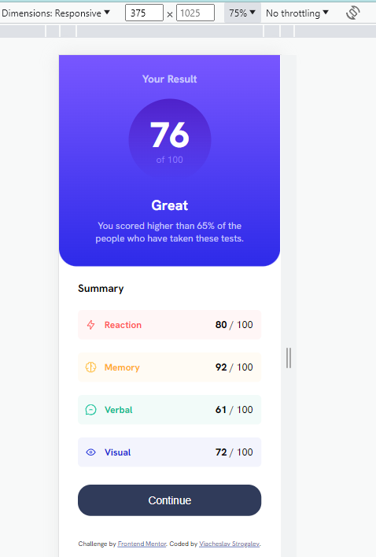
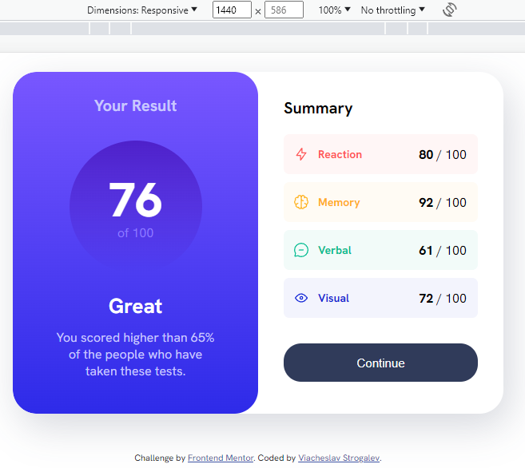

# Frontend Mentor - Results summary component solution

This is a solution to the [Results summary component challenge on Frontend Mentor](https://www.frontendmentor.io/challenges/results-summary-component-CE_K6s0maV). Frontend Mentor challenges help you improve your coding skills by building realistic projects. 

## Table of contents

- [Overview](#overview)
  - [The challenge](#the-challenge)
  - [Screenshots](#screenshots)
  - [Links](#links)
- [My process](#my-process)
  - [Built with](#built-with)
  - [Continued development](#continued-development)
- [Author](#author)

## Overview

### The challenge

Work without figma maket was pretty challenged. But it helped me to be confident with pixel perfect techniques.
Also I didn't have experience with gradients.

### Screenshots

### Links

- Solution URL: [github](https://github.com/vstrogalev/results-summary-component-main)
- Live Site URL: [netlify](https://results-summary-component-sls.netlify.app)

## My process

### Built with

- Semantic HTML5 markup
- CSS custom properties
- Flexbox
- CSS Grid
- Mobile-first workflow

### Continued development

I'd like to use relation measures (em, rem) to make adaptive more faster and easier.

## Author

- Website - [Viacheslav Strogalev](https://strogalev.com)
- Frontend Mentor - [@vstrogalev](https://www.frontendmentor.io/profile/vstrogalev)

